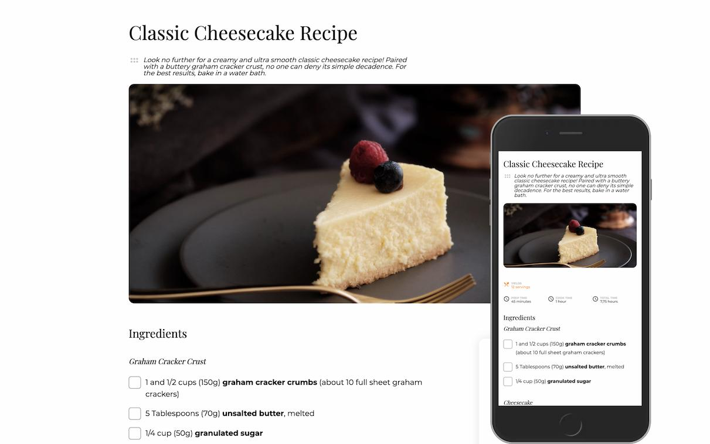

<h1 align="center">Recipe Page</h1>
<div align="center">
   Solution for a challenge from  <a href="http://devchallenges.io" target="_blank">Devchallenges.io</a>.
</div>
<div align="center">
  <h3>
    <a href="https://alexbaezd.github.io/recipe-page/">
      Demo
    </a>
    <span> | </span>
    <a href="https://github.com/alexbaezd/recipe-page">
      Solution
    </a>
    <span> | </span>
    <a href="https://devchallenges.io/challenges/TtUjDt19eIHxNQ4n5jps">
      Challenge
    </a>
  </h3>
</div>

<!-- TABLE OF CONTENTS -->

## Table of Contents

- [Overview](#overview)
  - [Built With](#built-with)
- [Features](#features)
- [How to use](#how-to-use)
- [Contact](#contact)
- [Acknowledgements](#acknowledgements)

## Overview



### Built With

- HTML
- CSS
  - CSS Grid

## Features

This application/site was created as a submission to a [DevChallenges](https://devchallenges.io/challenges) challenge. The [challenge](https://devchallenges.io/challenges/TtUjDt19eIHxNQ4n5jps) was to build an application to complete the following user stories:

- [x] User story: I can see a recipe with ingredients and instructions
- [x] User story: I can select a checkbox if I have the ingredients
- [x] User story: I can see the number of servings, baking times

## How To Use

To clone and run this application, you'll need [Git](https://git-scm.com) installed on your computer. From your command line:

```bash
# Clone this repository
$ git clone https://github.com/your-user-name/your-project-name

# Install dependencies
$ cd recipe-page

# Open index.html on the browser
```

## Acknowledgements

- [Sticky CSS Grid Items](https://melanie-richards.com/blog/css-grid-sticky/)
- [Pure CSS Custom Checkbox Style](https://moderncss.dev/pure-css-custom-checkbox-style/)
- [Custom List Number Styling](https://css-tricks.com/custom-list-number-styling/)
- [Defer non-critical CSS](https://web.dev/defer-non-critical-css/)

## Contact

- Website [alexbaez.dev](https://alexbaez.dev)
- GitHub [@alexbaezd](https://github.com/alexbaezd)
